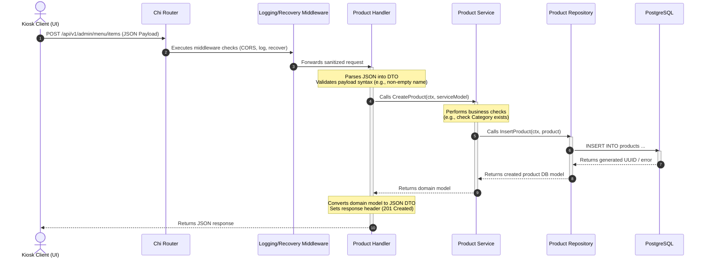

# NextGen Kiosk-to-Kitchen Fast Food System — Developer Guide

Welcome to the **NextGen Kiosk-to-Kitchen Fast Food System**! This codebase is structured using clean, layered architecture principles in Go (Golang). This guide is written specifically for junior developers to help you understand **how** the project is structured, **why** it was designed this way, and **how** you can safely add new features, APIs, and services without breaking the architecture.

---

## 1. Project Architecture Overview

This project follows a **Layered (Clean) Architecture**. The primary objective is to separate infrastructure (like web routers and database drivers) from core business rules. This separation makes our code testable, maintainable, and adaptable to future changes.

### Folder Structure

Here is a breakdown of the directories in the project:

```text
fastFoodSystem/
├── cmd/
│   └── api/
│       └── main.go                 # App entry point (wiring and bootstrapping)
├── internal/                       # Private application code (cannot be imported externally)
│   ├── config/                     # Configuration loading (Viper, .env binding)
│   ├── database/                   # Database connection pool setup (pgxpool)
│   ├── handlers/                   # HTTP handlers/controllers (Chi endpoints)
│   ├── logger/                     # Structured logging configuration (slog)
│   ├── middleware/                 # HTTP middlewares (logging, CORS, panic recovery)
│   ├── models/                     # Shared domain models & structs
│   ├── repository/                 # Database access layer (raw SQL, pgx)
│   └── service/                    # Core business logic layer
├── migrations/                     # Version-controlled SQL migration files
├── configs/                        # Environment config files (e.g., .env)
├── scripts/                        # Automation & scripting utilities
├── tests/                          # Integration and end-to-end tests
├── Makefile                        # Command shortcuts (make run, make test, etc.)
└── go.mod                          # Go module dependency list
```

### Purpose of Each Layer

1. **`cmd/api/main.go` (The Wireman):**
   This is the entry point. Its only job is to boot up the application, load configuration, initialize the database, instantiate repositories, services, and handlers, inject dependencies manually, register HTTP routes, and start the server with graceful shutdown.
2. **`internal/models/` (The Entities):**
   Contains our core structures (e.g., `Product`, `Order`, `User`) and data structures. It represents the "things" our system manipulates. This package has **zero dependencies** on other layers.
3. **`internal/repository/` (The Data Access Layer):**
   Responsible for database operations. It talks directly to PostgreSQL using `pgxpool.Pool`. No business rules are allowed here; its only job is to run SQL queries and map columns to/from Go structs.
4. **`internal/service/` (The Business Logic Layer):**
   This is the brain of the application. It implements the rules of the fast-food kiosk (e.g., "An order cannot be transitioned to 'Paid' if its payment status is 'Failed'", "Calculate tax and modifiers"). It knows nothing about HTTP, request parameters, or database tables. It only coordinates repositories.
5. **`internal/handlers/` (The Transport/Interface Layer):**
   Handles incoming HTTP requests. It parses JSON request bodies into Data Transfer Objects (DTOs), validates that inputs conform to correct syntax types, calls the appropriate service, and formats the output into a JSON HTTP response.

### Request and Dependency Flow

To maintain high decoupling, the dependency flow and execution flow run in opposite or parallel paths:

* **Execution Flow (Outgoing):**
  `HTTP Request` ➔ `Middlewares` ➔ `Handler` ➔ `Service` ➔ `Repository` ➔ `PostgreSQL Database`
* **Dependency Flow (Inward / Code Imports):**
  `Handler` depends on ➔ `Service` ➔ depends on `Repository` ➔ depends on `Database Driver`

**Rule of Thumb:** A layer can only import from layers below it or peer packages (like `models`, `logger`, `config`). A database repository must **never** import a service or handler. A service must **never** import a handler or reference `net/http` contexts.

---

## 2. Development Philosophy

To write code that is clean, readable, and easy to maintain, we enforce several design principles:

### Separation of Concerns (SoC) & Single Responsibility Principle (SRP)
Every package, file, struct, and function should have **exactly one job**:
* If a function parses an HTTP request body **and** checks if a user is an admin **and** queries the database, it violates SRP.
* Break it down: let the middleware check auth, the handler parse the request, the service evaluate the rules, and the repository run the query.

### Dependency Injection (DI)
We do not use global variables or singleton pools for databases, configurations, or services. Global state makes testing and concurrent execution error-prone. Instead, we use **Constructor Injection**:
```go
// Good constructor injection
type ProductService struct {
    repo repository.ProductRepository
}

func NewProductService(repo repository.ProductRepository) *ProductService {
    return &ProductService{repo: repo}
}
```
During runtime, we inject real database repositories. During unit testing, we inject a "Mock" repository, allowing us to test services in isolation without running a database.

### Transport-Logic Isolation
The business logic layer (`internal/service`) must remain completely transport-agnostic.
* **Bad:** Passing `*http.Request` or `w http.ResponseWriter` to a service. What if we want to add a gRPC interface or a CLI tool later?
* **Good:** Extracting arguments into standard Go parameters (like `id string`, `limit int`) and passing them to the service.

### Validation Boundaries
* **Syntax/Format Validation (Handler):** "Is this an e-mail?", "Is the name empty?", "Is the amount field a positive number?"
* **Business Validation (Service):** "Does this product category exist in the database?", "Does the store have permission to sell this product?", "Is the order state transition valid?"

### Error Handling Philosophy
* We do **not** return database errors directly to the client. Doing so exposes database details (e.g., table structure, constraint names), which is a security risk.
* **Wrap errors:** Use Go's `%w` formatting to add context as errors bubble up:
  `fmt.Errorf("retrieving product: %w", err)`
* **Map errors to HTTP codes:** The service returns domain-specific errors (e.g. `ErrProductNotFound`). The handler checks these errors and decides whether to respond with `404 Not Found`, `400 Bad Request`, or `500 Internal Server Error`.

---

## 3. Request Lifecycle

The diagram below details the step-by-step lifecycle of an API request:



---

## 4. How to Add a New Feature

Let's walk through how to add a practical feature: **Create Product**.

Here is the exact step-by-step workflow with file structures, naming conventions, and common beginner mistakes to avoid.

### Step 1: Define the Domain Model
The model representing the database schema is already defined in [models.go](file:///c:/Users/Djhanggoo/Documents/Projects/FastFood%20System/fastFoodSystem/internal/models/models.go).
```go
type Product struct {
	ID          string    `json:"id" db:"id"`
	CategoryID  string    `json:"category_id" db:"category_id"`
	Name        string    `json:"name" db:"name"`
	Description string    `json:"description" db:"description"`
	BasePrice   int64     `json:"base_price" db:"base_price"`
	ImageURL    string    `json:"image_url" db:"image_url"`
	IsAvailable bool      `json:"is_available" db:"is_available"`
	CreatedAt   time.Time `json:"created_at" db:"created_at"`
	UpdatedAt   time.Time `json:"updated_at" db:"updated_at"`
}
```

### Step 2: Create Repository Methods
Create a new file: `internal/repository/product.go`

Here, define the database access interface and its implementation. Using interfaces allows mocking for tests.

```go
package repository

import (
	"context"
	"fmt"

	"github.com/D3rille/kk-fast-food-system/internal/models"
	"github.com/jackc/pgx/v5/pgxpool"
)

// ProductRepository defines database interactions for Products.
type ProductRepository interface {
	Create(ctx context.Context, p *models.Product) error
	GetByID(ctx context.Context, id string) (*models.Product, error)
}

type postgresProductRepository struct {
	db *pgxpool.Pool
}

// NewProductRepository creates a concrete repository implementation.
func NewProductRepository(db *pgxpool.Pool) ProductRepository {
	return &postgresProductRepository{db: db}
}

func (r *postgresProductRepository) Create(ctx context.Context, p *models.Product) error {
	query := `
		INSERT INTO products (id, category_id, name, description, base_price, image_url, is_available, created_at, updated_at)
		VALUES ($1, $2, $3, $4, $5, $6, $7, $8, $9)
	`
	_, err := r.db.Exec(ctx, query, p.ID, p.CategoryID, p.Name, p.Description, p.BasePrice, p.ImageURL, p.IsAvailable, p.CreatedAt, p.UpdatedAt)
	if err != nil {
		return fmt.Errorf("failed to insert product: %w", err)
	}
	return nil
}

func (r *postgresProductRepository) GetByID(ctx context.Context, id string) (*models.Product, error) {
	// Implement query similar to above mapping row to models.Product
	return nil, nil
}
```

*   **Why this layer is responsible:** It holds SQL queries. If we migrate from PostgreSQL to another database, this is the **only** layer that changes.
*   **Beginner Mistake:** Do not put validation checks like "is the price less than 0" in the SQL layer. This belongs in the Service or Handler layer.

### Step 3: Create Service Methods
Create a new file: `internal/service/product.go`

Define business operations. The service handles generating IDs, validating business rules, and saving.

```go
package service

import (
	"context"
	"errors"
	"time"

	"github.com/D3rille/kk-fast-food-system/internal/models"
	"github.com/D3rille/kk-fast-food-system/internal/repository"
)

var (
	ErrInvalidPrice = errors.New("price must be greater than zero")
	ErrEmptyName    = errors.New("product name cannot be empty")
)

type ProductService interface {
	CreateProduct(ctx context.Context, p *models.Product) (*models.Product, error)
}

type productService struct {
	repo repository.ProductRepository
}

func NewProductService(repo repository.ProductRepository) ProductService {
	return &productService{repo: repo}
}

func (s *productService) CreateProduct(ctx context.Context, p *models.Product) (*models.Product, error) {
	// Business Rule Checks
	if p.Name == "" {
		return nil, ErrEmptyName
	}
	if p.BasePrice <= 0 {
		return nil, ErrInvalidPrice
	}

	// Prepare data
	p.ID = "prod_" + generateUUID() // Use an actual UUID library in practice
	p.IsAvailable = true
	p.CreatedAt = time.Now()
	p.UpdatedAt = time.Now()

	err := s.repo.Create(ctx, p)
	if err != nil {
		return nil, err
	}

	return p, nil
}

func generateUUID() string {
	// Stub UUID helper
	return "unique-uuid-1234"
}
```

*   **Why this layer is responsible:** Ensures database-independent logic is enforced. If a customer creates an order, calculating item subtotals or verifying that items exist happens here.
*   **Beginner Mistake:** Do not import `net/http` inside `internal/service`. The service should never return an HTTP response status. It only returns data and errors.

### Step 4: Create Request/Response DTOs
Create a new file (or append): `internal/models/dto.go`

Using DTOs decouples the database schema from the API. We don't want fields like `CreatedAt` to be sent by the user, and we might want to validate input before processing.

```go
package models

// CreateProductRequest is the API payload for creating a product.
type CreateProductRequest struct {
	CategoryID  string `json:"category_id"`
	Name        string `json:"name"`
	Description string `json:"description"`
	BasePrice   int64  `json:"base_price"`
	ImageURL    string `json:"image_url"`
}

// ProductResponse is the API response payload.
type ProductResponse struct {
	ID          string `json:"id"`
	CategoryID  string `json:"category_id"`
	Name        string `json:"name"`
	Description string `json:"description"`
	BasePrice   int64  `json:"base_price"`
	ImageURL    string `json:"image_url"`
	IsAvailable bool   `json:"is_available"`
}
```

*   **Why this layer is responsible:** Decoupling models prevents the database schema from automatically exposing columns on the API.

### Step 5: Create Handler/Controller
Create a new file: `internal/handlers/product.go`

```go
package handlers

import (
	"encoding/json"
	"errors"
	"net/http"

	"github.com/D3rille/kk-fast-food-system/internal/models"
	"github.com/D3rille/kk-fast-food-system/internal/service"
)

type ProductHandler struct {
	srv service.ProductService
}

func NewProductHandler(srv service.ProductService) *ProductHandler {
	return &ProductHandler{srv: srv}
}

func (h *ProductHandler) Create(w http.ResponseWriter, r *http.Request) {
	w.Header().Set("Content-Type", "application/json")

	var req models.CreateProductRequest
	if err := json.NewDecoder(r.Body).Decode(&req); err != nil {
		w.WriteHeader(http.StatusBadRequest)
		_, _ = w.Write([]byte(`{"error":"invalid JSON request"}`))
		return
	}

	// Syntax check
	if req.Name == "" {
		w.WriteHeader(http.StatusBadRequest)
		_, _ = w.Write([]byte(`{"error":"name is required"}`))
		return
	}

	// Convert DTO to domain object
	prod := &models.Product{
		CategoryID:  req.CategoryID,
		Name:        req.Name,
		Description: req.Description,
		BasePrice:   req.BasePrice,
		ImageURL:    req.ImageURL,
	}

	// Call service
	created, err := h.srv.CreateProduct(r.Context(), prod)
	if err != nil {
		if errors.Is(err, service.ErrInvalidPrice) || errors.Is(err, service.ErrEmptyName) {
			w.WriteHeader(http.StatusBadRequest)
			_ = json.NewEncoder(w).Encode(map[string]string{"error": err.Error()})
			return
		}

		w.WriteHeader(http.StatusInternalServerError)
		_, _ = w.Write([]byte(`{"error":"internal server error"}`))
		return
	}

	// Convert domain object back to response DTO
	resp := models.ProductResponse{
		ID:          created.ID,
		CategoryID:  created.CategoryID,
		Name:        created.Name,
		Description: created.Description,
		BasePrice:   created.BasePrice,
		ImageURL:    created.ImageURL,
		IsAvailable: created.IsAvailable,
	}

	w.WriteHeader(http.StatusCreated)
	_ = json.NewEncoder(w).Encode(resp)
}
```

*   **Why this layer is responsible:** The handler isolates HTTP details. If you change status codes or switch framework styles, it is updated here.
*   **Beginner Mistake:** Do not parse SQL errors directly. Handlers should not log raw queries or database credentials.

### Step 6: Register Routes
Modify: `cmd/api/main.go`

Instantiate layers and connect them.

```go
	// In cmd/api/main.go (inside main function):

	// 1. Initialize Repositories
	productRepo := repository.NewProductRepository(db)

	// 2. Initialize Services
	productSrv := service.NewProductService(productRepo)

	// 3. Initialize Handlers
	productHandler := handlers.NewProductHandler(productSrv)

	// 4. Mount Routes
	r.Route("/api/v1", func(r chi.Router) {
		r.Route("/admin/menu", func(r chi.Router) {
			r.Post("/items", productHandler.Create)
		})
	})
```

### Step 7: Add Tests
Create a new file: `internal/service/product_test.go`

Write unit tests for the business logic. Mock your repository layer so that tests do not require a live database.

---

## 5. API Development Guidelines

### Naming Conventions
*   **Exported Go symbols:** PascalCase (e.g. `ProductHandler`, `CreateProduct`).
*   **Internal variables/private helper functions:** camelCase (e.g. `parseLevel`).
*   **JSON API payload fields:** snake_case (e.g. `category_id`, `base_price`).
*   **Database columns:** snake_case.

### Struct Naming Conventions
*   Database-mapped entities: Singular noun (e.g. `Order`, `Product`, `Category`).
*   Request payloads: `[Action][Entity]Request` (e.g. `CreateProductRequest`).
*   Response payloads: `[Entity]Response` or `[Action][Entity]Response` (e.g. `ProductResponse`).

### Interface Design Guidelines
*   Keep interfaces small. In Go, "the bigger the interface, the weaker the abstraction" (Go Proverbs).
*   Define interfaces in the package where they are **consumed/needed** or where the logic belongs, rather than where they are implemented. In this project:
    *   `ProductRepository` interface is declared in `internal/repository/product.go`.
    *   `ProductService` interface is declared in `internal/service/product.go`.

### Error Handling Standards
*   Always check error returns immediately.
*   Use `%w` for error wrapping: `fmt.Errorf("reading category database record: %w", err)`.
*   Avoid throwing generic errors. Create sentinel errors in package definitions to distinguish between expected errors and systemic failures.

### Logging Standards
*   Use the structured logger `slog`.
*   Pass contextual key-value fields. Do **not** concatenate variables in logs:
    *   **Bad:** `log.Info("created product " + p.ID)`
    *   **Good:** `log.Info("product created", "product_id", p.ID, "category_id", p.CategoryID)`
*   Use appropriate logging levels:
    *   `DEBUG`: Highly verbose telemetry (e.g., SQL queries executing, timing values).
    *   `INFO`: Normal operational milestones (e.g., HTTP server startup, user logged in).
    *   `WARN`: Non-fatal issues (e.g., slow query response, failed client request).
    *   `ERROR`: System failure events that need immediate developer attention.

---

## 6. Service Development Guidelines

### What Belongs in a Service
*   Validating business conditions (e.g., checking if product is active, verifying item exists).
*   Enforcing calculations (e.g., tax calculations, ordering limits).
*   Orchestrating database transactions (rolling back if one step in order placement fails).
*   Triggering external events (e.g., sending WebSocket updates to KDS, printing receipt).

### What Should Never Go in Service Layer
*   HTTP handlers or variables (`net/http`, cookies, headers).
*   Database Connection Pooling drivers directly (like `pgx.Conn` or raw pgx transaction handling blocks, without repository abstractions).
*   Direct API Gateway logic.

### Good vs. Bad Implementation Example

#### Bad Service (Violates SoC, tightly coupled to transport and database):
```go
package service

import (
	"database/sql"
	"net/http"
)

// BAD: Tightly coupled to HTTP writer and sql.DB
func CreateProductBad(db *sql.DB, w http.ResponseWriter, r *http.Request) {
	name := r.FormValue("name")
	price := r.FormValue("price")

	if name == "" {
		w.WriteHeader(400)
		_, _ = w.Write([]byte("Name is empty"))
		return
	}

	_, err := db.Exec("INSERT INTO products (name, price) VALUES ($1, $2)", name, price)
	if err != nil {
		w.WriteHeader(500)
		return
	}
	w.WriteHeader(200)
}
```

#### Good Service (Pure, testable logic):
```go
package service

import (
	"context"
	"errors"
	"github.com/D3rille/kk-fast-food-system/internal/models"
	"github.com/D3rille/kk-fast-food-system/internal/repository"
)

type ProductService struct {
	repo repository.ProductRepository
}

func (s *ProductService) CreateProduct(ctx context.Context, p *models.Product) (*models.Product, error) {
	if p.Name == "" {
		return nil, errors.New("product name is required")
	}
	if p.BasePrice <= 0 {
		return nil, errors.New("price must be positive")
	}

	err := s.repo.Create(ctx, p)
	if err != nil {
		return nil, err
	}
	return p, nil
}
```

---

## 7. Automated Scaffolding Tool

To make adding features even faster and less prone to manual errors, the project includes an automated scaffolding tool written in Go: [scaffold.go](file:///c:/Users/Djhanggoo/Documents/Projects/FastFood%20System/fastFoodSystem/scripts/scaffold.go).

This tool automatically generates the boilerplate files for your features under:
*   `internal/models/` (Request/Response DTOs)
*   `internal/repository/` (CRUD SQL repository implementation)
*   `internal/service/` (Core service business logic placeholders)
*   `internal/handlers/` (Chi HTTP endpoints)
*   `internal/service/` (Unit test boilerplate)

### How to Use the Scaffolder

Run the script from the root of the project using standard Go execution:

```bash
# General Usage
go run scripts/scaffold.go <FeatureName>

# Example: Generate an 'Inventory' feature
go run scripts/scaffold.go Inventory
```

#### Overwriting Existing Files
By default, the script will skip any files that already exist to prevent losing your custom code. If you intentionally want to regenerate a feature and overwrite existing files, add the `-force` flag:

```bash
go run scripts/scaffold.go -force Inventory
```

### What Happens Next

After running the command, the tool output will print exact instructions on how to wire the newly generated structs and handlers into your application inside [main.go](file:///c:/Users/Djhanggoo/Documents/Projects/FastFood%20System/fastFoodSystem/cmd/api/main.go).

---

## 8. Feature Creation Template

Use this template as a quick checklist when building a new feature:

```markdown
### Feature Name: [e.g., Get Category Items]

#### 1. Database & Migrations
- [ ] Create a migration if fields/tables change: `make migrate-create name=add_categories_table`
- [ ] Edit the generated sql file in `/migrations/`
- [ ] Apply migration locally: `make migrate-up`

#### 2. Models & DTOs
- [ ] Add model in `internal/models/models.go` (if not exists)
- [ ] Add request DTO in `internal/models/dto.go`
- [ ] Add response DTO in `internal/models/dto.go`

#### 3. Repository Layer
- [ ] Define repository interface in `internal/repository/[feature].go`
- [ ] Implement methods using `pgx` in `internal/repository/[feature].go`
- [ ] Register repository in `cmd/api/main.go`

#### 4. Service Layer
- [ ] Define business service interface in `internal/service/[feature].go`
- [ ] Implement validation and business logic in `internal/service/[feature].go`
- [ ] Register service in `cmd/api/main.go`

#### 5. Handler Layer
- [ ] Implement HTTP controller inside `internal/handlers/[feature].go`
- [ ] Bind request body JSON to DTO
- [ ] Translate service layer errors to HTTP status codes
- [ ] Register routes in `cmd/api/main.go`

#### 6. Verification & Tests
- [ ] Write service unit test in `internal/service/[feature]_test.go`
- [ ] Run `make lint` and fix any warnings
- [ ] Run `make test` to verify everything compiles and passes
```

---

## 9. Architecture Rules

These rules are **mandatory** for all contributors:

1.  **No Business Logic in Handlers:** Handlers are strictly for decoding, basic syntax checks, calling services, and writing responses.
2.  **No HTTP Context in Services/Repositories:** Do not import `net/http` or use `http.ResponseWriter` inside service or repository packages.
3.  **No Raw SQL in Handlers/Services:** SQL queries belong in the Repository layer. Services must interact through Repository interfaces.
4.  **No Shared Global State:** Pass dependencies explicitly through constructor functions (e.g. `NewService(repo)`). Avoid `init()` functions that set up global connections.
5.  **Always Contextualize Errors:** Use `%w` when wrapping errors as they bubble up: `fmt.Errorf("failed during operation: %w", err)`.
6.  **Always Accept `context.Context`:** Database operations, service methods, and handlers must accept `ctx context.Context` as their first parameter to enable request cancellation and timeout propagation.

---

## 10. Feature Development Checklist

Before submitting a Pull Request, run through this list:

- [ ] Core business requirements are implemented completely.
- [ ] DB schema changes are written as SQL migrations under `/migrations/`.
- [ ] Request input is validated syntax-wise in the Handler.
- [ ] Business logic validation occurs inside the Service layer.
- [ ] Interfaces are used to inject dependencies.
- [ ] Code is formatted using standard Go fmt: `make fmt`.
- [ ] Code passes all linter rules: `make lint` (`golangci-lint` passes).
- [ ] Unit tests are written for new service functions.
- [ ] All unit and integration tests pass cleanly: `make test`.
- [ ] Server starts successfully and handles health check endpoints correctly (`/healthz`, `/readyz`).

---

## 11. Examples From This Codebase

To keep your code consistent with the rest of the project, follow these working examples:

### Routing Configuration
See [main.go](file:///c:/Users/Djhanggoo/Documents/Projects/FastFood%20System/fastFoodSystem/cmd/api/main.go) for details on route grouping, setting timeouts, and mounting routers:
```go
r := chi.NewRouter()
r.Use(chiMiddleware.RealIP)
r.Use(middleware.Recovery(log))
r.Use(middleware.Logging(log))
r.Use(middleware.CORS())
```

### Writing a Handler
Reference [health.go](file:///c:/Users/Djhanggoo/Documents/Projects/FastFood%20System/fastFoodSystem/internal/handlers/health.go) to see how responses are encoded and how database pools are used for connectivity checks:
```go
func (h *HealthHandler) Readyz(w http.ResponseWriter, r *http.Request) {
	w.Header().Set("Content-Type", "application/json")
	
	ctx, cancel := context.WithTimeout(r.Context(), 2*time.Second)
	defer cancel()

	if err := h.db.Ping(ctx); err != nil {
		w.WriteHeader(http.StatusServiceUnavailable)
		_ = json.NewEncoder(w).Encode(map[string]string{
			"status":   "Unavailable",
			"database": "unreachable: " + err.Error(),
		})
		return
	}
	// ...
}
```

### Loading Configuration
See [config.go](file:///c:/Users/Djhanggoo/Documents/Projects/FastFood%20System/fastFoodSystem/internal/config/config.go) to see how defaults are configured and bound to environment variables:
```go
v.SetDefault("server.port", 8080)
_ = v.BindEnv("server.port", "SERVER_PORT")
```

---

With this guide, you now have all the tools and architectural understanding needed to safely and correctly write APIs, services, and features for the NextGen Kiosk-to-Kitchen Fast Food System. Happy coding!
